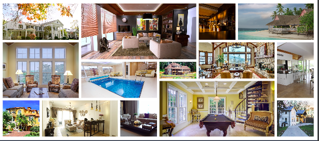

# Nexter - CSS Grid Practice

Nexter is a landing page of a fictional company which sells luxury home across the world. The goal of this project is to build a responsive page using as many grids as possible.
Developed with [Jonas Schmedtmann's Advanced CSS and Sass course](https://www.udemy.com/course/advanced-css-and-sass/)



### Getting started

Clone or download project and then run:

```
npm install
npm start
```

Project is set to open on `//127.0.0.1:8080` address in the Firefox browser by default.

### Used Technologies:

- **SCSS**: Styled with SCSS for more efficient, readable styling.
- **CSS Grid**: Extensive use of CSS Grids for a modern, sophisticated layout.
- **SVG Icons**: Incorporates a sprite generated through [icomoon.app](icomoon.app) for crisp, scalable icons.
- **Responsive Design**: Utilizes a Desktop First strategy to ensure the site looks great on all devices.
- **BEM Methodology**: Adheres to BEM (Block Element Modifier) naming convention for CSS classes, enhancing readability and maintainability.

### Acknowledgments

Jonas Schmedtmann for the inspiring [ Advanced CSS and Sass course](https://www.udemy.com/course/advanced-css-and-sass/).
